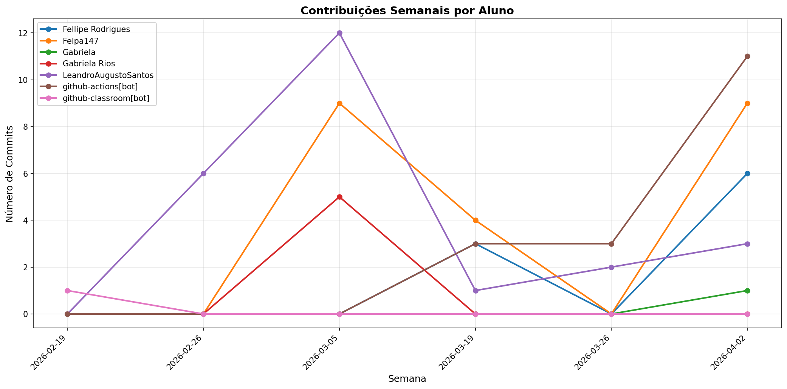

# 📊 Relatório de Contribuições do Projeto

**Última atualização:** 09/04/2026 02:59

---

## 📈 Resumo Geral de Contribuições

| Aluno                 |   Commits |   Linhas+ |   Linhas- |   Arquivos |   Docs Commits |   Docs Arquivos |
|-----------------------|-----------|-----------|-----------|------------|----------------|-----------------|
| Fellipe Rodrigues     |         9 |      8771 |       266 |        102 |              0 |               0 |
| Felpa147              |        22 |       636 |       144 |          5 |             19 |               5 |
| Gabriela              |         1 |       382 |         0 |         12 |              0 |               0 |
| Gabriela Rios         |         5 |        42 |        52 |          2 |              5 |               2 |
| LeandroAugustoSantos  |        24 |        66 |       154 |          6 |             23 |               4 |
| github-actions[bot]   |        17 |       120 |       120 |          3 |             17 |               1 |
| github-classroom[bot] |         1 |      2152 |         0 |         45 |              1 |              13 |

## 📅 Contribuições Semanais (Todo o Semestre)

**2026-04-02**: Fellipe Rodrigues: 6, Felpa147: 9, Gabriela: 1, LeandroAugustoSantos: 3, github-actions[bot]: 11

**2026-03-26**: LeandroAugustoSantos: 2, github-actions[bot]: 3

**2026-03-19**: Fellipe Rodrigues: 3, Felpa147: 4, LeandroAugustoSantos: 1, github-actions[bot]: 3

**2026-03-05**: Felpa147: 9, Gabriela Rios: 5, LeandroAugustoSantos: 12

**2026-02-26**: LeandroAugustoSantos: 6

**2026-02-19**: github-classroom[bot]: 1

## 📊 Visualização Gráfica

## ℹ️ Observações

- **Commits**: Número total de commits realizados

- **Linhas+**: Linhas de código adicionadas

- **Linhas-**: Linhas de código removidas

- **Arquivos**: Número de arquivos únicos modificados

- **Docs Commits**: Commits em arquivos de documentação

- **Docs Arquivos**: Arquivos de documentação modificados

---

*Relatório gerado automaticamente via GitHub Actions*
