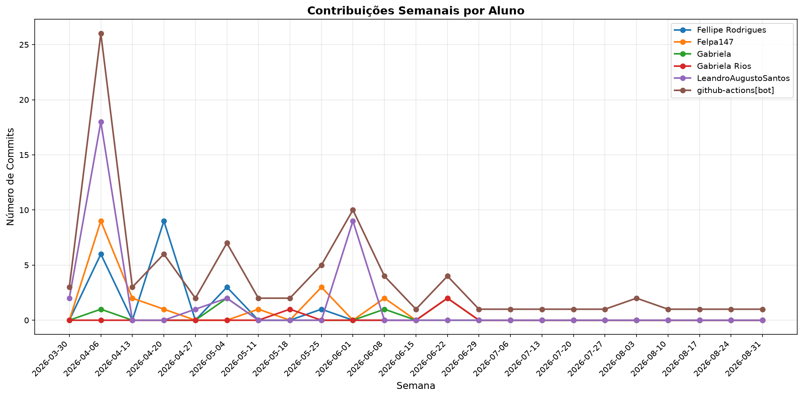

# 📊 Relatório de Contribuições do Projeto

**Última atualização:** 07/06/2026 13:51

---

## 📈 Resumo Geral de Contribuições

| Aluno                 |   Commits |   Linhas+ |   Linhas- |   Arquivos |   Docs Commits |   Docs Arquivos |
|-----------------------|-----------|-----------|-----------|------------|----------------|-----------------|
| Fellipe Rodrigues     |        22 |     37569 |      1027 |        257 |              4 |               3 |
| Felpa147              |        29 |       758 |       231 |          6 |             25 |               6 |
| Gabriela              |         3 |      2579 |       491 |         36 |              0 |               0 |
| Gabriela Rios         |         6 |        56 |        66 |          3 |              6 |               3 |
| LeandroAugustoSantos  |        44 |       610 |       175 |         11 |             37 |               4 |
| github-actions[bot]   |        61 |       457 |       440 |          3 |             61 |               1 |
| github-classroom[bot] |         1 |      2152 |         0 |         45 |              1 |              13 |

## 📅 Contribuições Semanais (Todo o Semestre)

**2026-05-31**: LeandroAugustoSantos: 2, github-actions[bot]: 2

**2026-05-24**: Fellipe Rodrigues: 1, Felpa147: 3, github-actions[bot]: 5

**2026-05-17**: Gabriela Rios: 1, github-actions[bot]: 2

**2026-05-10**: Fellipe Rodrigues: 3, Felpa147: 1, LeandroAugustoSantos: 2, github-actions[bot]: 7

**2026-05-03**: Gabriela: 2, github-actions[bot]: 2

**2026-04-26**: LeandroAugustoSantos: 1, github-actions[bot]: 2

**2026-04-19**: Fellipe Rodrigues: 9, Felpa147: 1, github-actions[bot]: 6

**2026-04-12**: Felpa147: 2, github-actions[bot]: 3

**2026-04-05**: Fellipe Rodrigues: 6, Felpa147: 9, Gabriela: 1, LeandroAugustoSantos: 18, github-actions[bot]: 26

**2026-03-29**: LeandroAugustoSantos: 2, github-actions[bot]: 3

**2026-03-22**: Fellipe Rodrigues: 3, Felpa147: 4, LeandroAugustoSantos: 1, github-actions[bot]: 3

**2026-03-08**: Felpa147: 5, LeandroAugustoSantos: 8

**2026-03-01**: Felpa147: 4, Gabriela Rios: 5, LeandroAugustoSantos: 10

**2026-02-15**: github-classroom[bot]: 1

## 📊 Visualização Gráfica

## ℹ️ Observações

- **Commits**: Número total de commits realizados

- **Linhas+**: Linhas de código adicionadas

- **Linhas-**: Linhas de código removidas

- **Arquivos**: Número de arquivos únicos modificados

- **Docs Commits**: Commits em arquivos de documentação

- **Docs Arquivos**: Arquivos de documentação modificados

---

*Relatório gerado automaticamente via GitHub Actions*
