# Front-end Móvel

O front-end móvel do SmartSíndico foi desenvolvido em Expo React Native com TypeScript. Esta etapa cobre o recorte de responsabilidade individual referente a autenticação, CRUD de usuários e mural de avisos. Os demais módulos do sistema, como visitantes, acessos, reservas, ocorrências e apartamentos, ficam fora desta entrega mobile.

O aplicativo consome a API REST existente no back-end ASP.NET Core, mantendo a arquitetura distribuída cliente-servidor definida no projeto. A autorização final permanece no back-end, enquanto o aplicativo aplica regras de visibilidade para evitar que cada perfil veja ações incompatíveis com suas permissões.

Além das telas funcionais desta entrega, a aba `Mais` também apresenta visualmente as demais áreas já existentes ou previstas no sistema. Portaria, visitantes, apartamentos, reservas e ocorrências aparecem como módulos em preparação e abrem uma tela informativa, sem integração com API nesta etapa.

## Projeto da Interface

A interface móvel foi organizada para uso em telas pequenas, com navegação principal por abas após a autenticação. O usuário acessa a aplicação pela tela de login e, após a sessão ser restaurada ou criada, navega entre Início, Mural, Usuários, Perfil e Mais.

### Funcionalidades cobertas

- Login com e-mail e senha;
- Persistência e restauração de sessão com token JWT;
- Logout;
- Home autenticada com visão geral e atalhos frequentes;
- Tema claro e escuro alinhado ao front-end web;
- Ícones nas abas, cartões e ações principais;
- Aba `Mais` com módulos futuros: portaria, visitantes, apartamentos, reservas e ocorrências;
- Perfil do usuário autenticado;
- Listagem, busca, paginação e filtro de usuários por status;
- Cadastro, edição e ativação/desativação de usuários;
- Listagem, paginação e filtro de comunicados por status;
- Detalhe de comunicado;
- Criação de comunicado;
- Marcar/remover destaque de comunicado;
- Ativar/desativar comunicado.

### Wireframes

Os wireframes da etapa mobile foram registrados a partir das telas implementadas no aplicativo. As imagens abaixo mostram a estrutura real da navegação, dos formulários e das áreas funcionais desta entrega.

| Tela | Wireframe visual |
| --- | --- |
| Login | 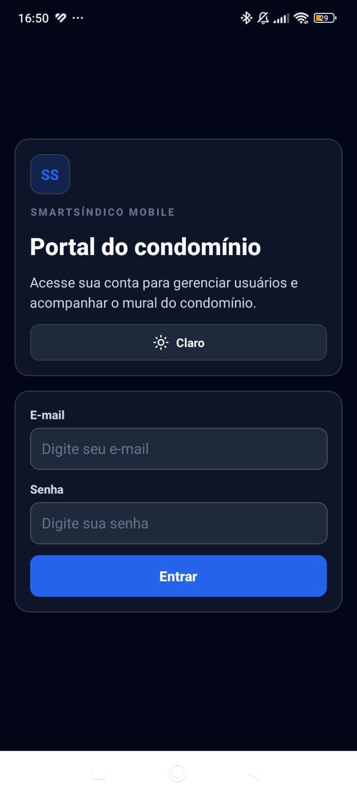 |
| Início em tema claro |  |
| Início em tema escuro | 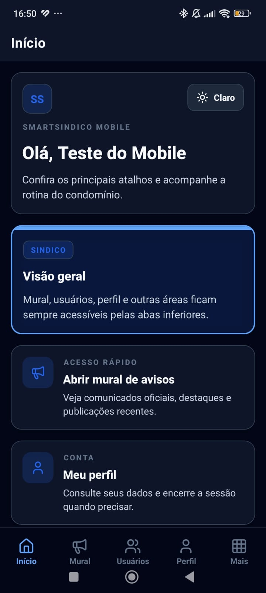 |
| Resumos da home | 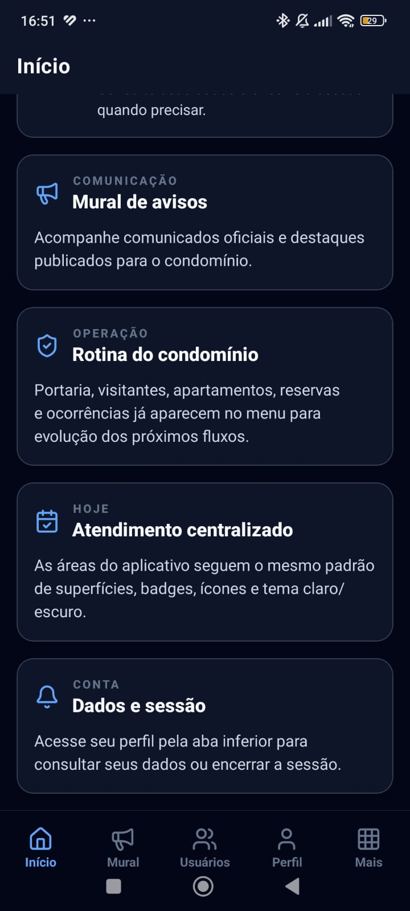 |
| Usuários com busca e ações | 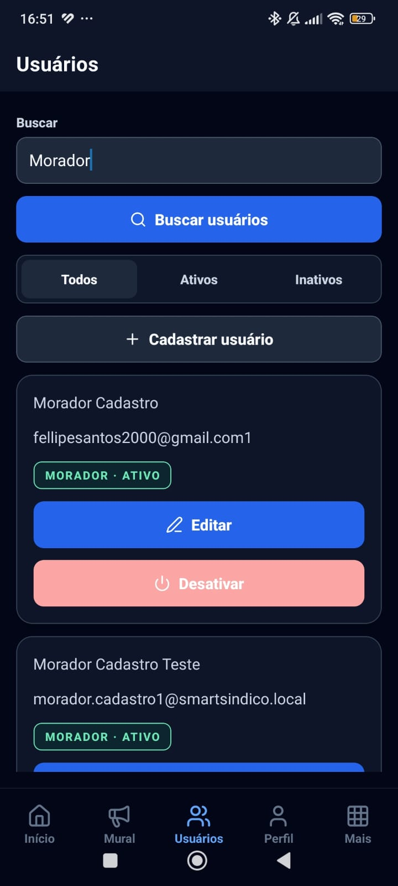 |
| Paginação de usuários | 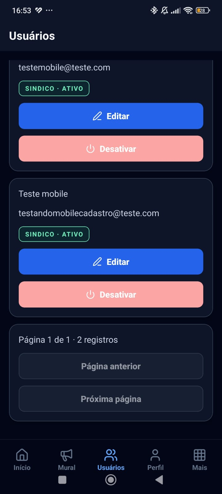 |
| Mural com destaque |  |
| Lista do mural com cards destacados | 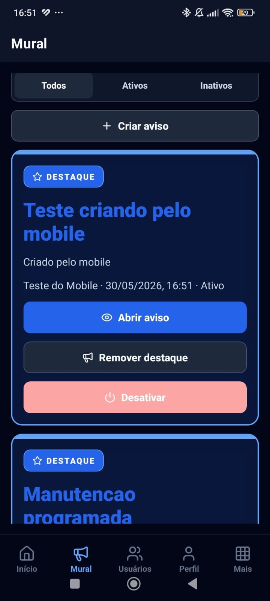 |
| Detalhe do aviso | 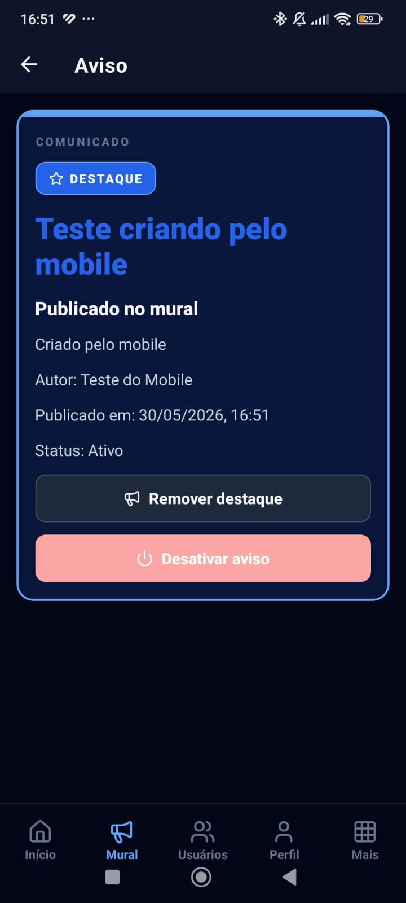 |
| Perfil | 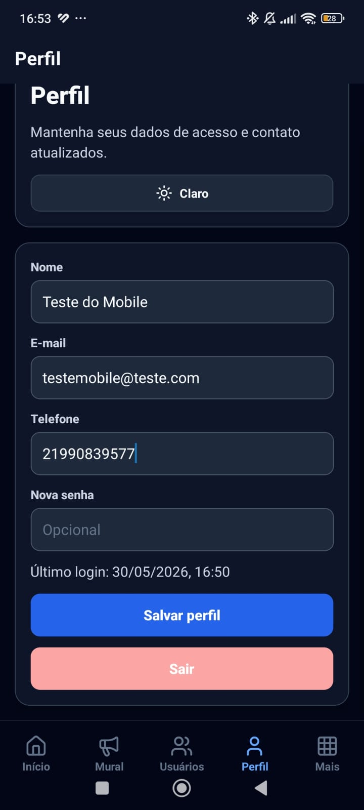 |
| Mais | 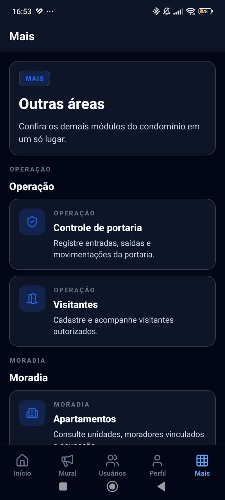 |
| Mais com módulos adicionais | 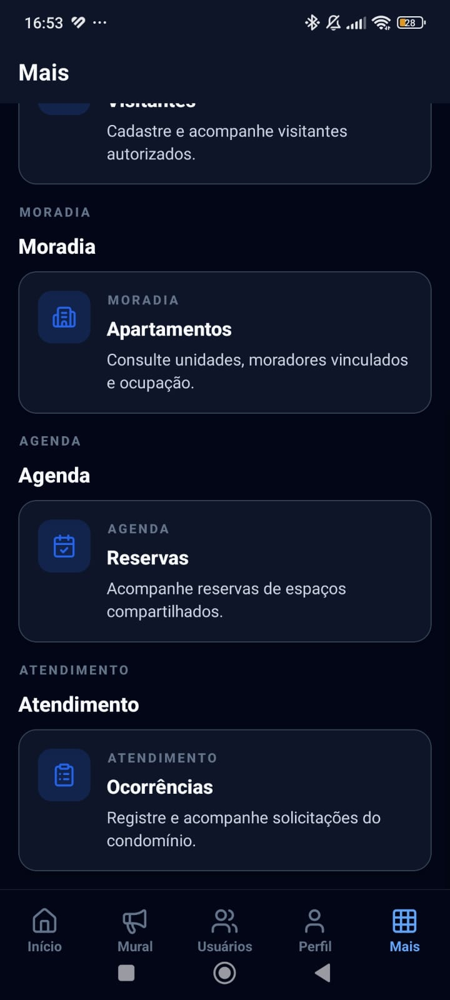 |

O fluxo funcional da navegação é representado pelo diagrama abaixo:

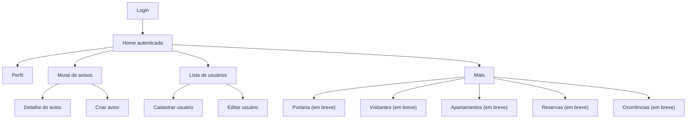

### Design Visual

O design móvel foi ajustado para se aproximar da identidade visual do front-end web. A paleta utiliza azul como cor de marca (`#2563eb`), tons de `ink/slate` para textos e superfícies, além de verde/menta para elementos positivos e vermelho para ações destrutivas. O aplicativo possui modo claro e modo escuro, seguindo o mesmo conceito de superfícies, bordas suaves, cartões e contraste usados no portal web.

A navegação principal usa abas inferiores, padrão mais adequado ao uso mobile. Início, mural, usuários e perfil ficam sempre acessíveis, enquanto a aba `Mais` concentra portaria, visitantes, apartamentos, reservas e ocorrências. Nesta entrega, esses módulos direcionam para uma tela `Em breve`, sem consumo de back-end.

A interface prioriza cartões compactos, botões com ícones, filtros segmentados e formulários verticais. O botão primário segue o contraste do portal web: fundo `ink` no tema claro e azul de marca no tema escuro. Comunicados em destaque recebem borda reforçada, fundo de marca suave e faixa superior, reproduzindo no mobile o destaque visual usado no card web de avisos.

Nas telas de listagem, os filtros, ações, resultados e paginação ficam dentro de uma única área rolável. Essa decisão evita que cabeçalhos e controles fixos ocupem a maior parte da tela do celular, mantendo espaço útil para visualizar a lista de usuários e os comunicados do mural.

O Tailwind permanece como tecnologia do front-end web. No mobile, as classes CSS do portal foram mapeadas para componentes React Native equivalentes: `surface-card` virou `Card`, `theme-control` virou `TextField`, `theme-primary-button` e `theme-secondary-button` viraram `AppButton`, `pill` virou `Badge` e `theme-filter-group` virou `FilterBar`.

### Evidências visuais

As imagens abaixo registram a execução do aplicativo mobile em dispositivo Android, demonstrando a identidade visual, navegação por abas, tema claro/escuro e os fluxos sob responsabilidade desta entrega.

| Tela | Evidência |
| --- | --- |
| Login em tema escuro |  |
| Home autenticada em tema claro |  |
| Home autenticada em tema escuro |  |
| Home com resumos e atalhos |  |
| Perfil em tema escuro |  |
| Lista de usuários |  |
| Paginação de usuários |  |
| Mural de avisos |  |
| Detalhe de aviso destacado |  |
| Aba Mais com módulos futuros |  |
| Aba Mais com categorias adicionais |  |

## Fluxo de Dados

O fluxo de dados segue o padrão cliente-servidor:

1. O usuário interage com uma tela React Native.
2. A tela chama um service TypeScript.
3. O service usa Axios para enviar requisições HTTP à API.
4. O token JWT salvo localmente é incluído no cabeçalho `Authorization`.
5. A API valida autenticação, autorização e regras de negócio.
6. A resposta JSON atualiza o estado da tela.
7. A interface exibe dados, mensagens de erro ou confirmação.

## Tecnologias Utilizadas

- `Expo`: ambiente de desenvolvimento React Native;
- `React Native`: construção da interface móvel;
- `TypeScript`: tipagem estática dos contratos e componentes;
- `React Navigation`: navegação autenticada, abas inferiores e pilhas de telas;
- `Lucide React Native`: iconografia da interface;
- `React Native SVG`: suporte aos ícones vetoriais;
- `Axios`: comunicação HTTP com a API;
- `Expo Secure Store`: persistência local da sessão;
- `Jest`: execução de testes automatizados;
- `React Native Testing Library`: testes de comportamento de telas.

## Integração com a API

O aplicativo utiliza a variável `EXPO_PUBLIC_API_BASE_URL` para configurar o endereço da API. Em desenvolvimento local, o valor padrão é:

```env
EXPO_PUBLIC_API_BASE_URL=http://localhost:5053/api
```

A variável também aceita mais de uma URL separada por vírgula. Nesse caso, o aplicativo tenta a primeira URL configurada e, se houver falha de conexão, tenta a próxima. Essa configuração facilita alternar entre teste no navegador do computador e teste no celular físico pela rede local:

```env
EXPO_PUBLIC_API_BASE_URL=http://localhost:5053/api,http://SEU_IP:5053/api
```

Em emulador Android, recomenda-se usar:

```env
EXPO_PUBLIC_API_BASE_URL=http://10.0.2.2:5053/api
```

### Endpoints consumidos

| Área | Endpoint | Uso |
| --- | --- | --- |
| Autenticação | `POST /api/autenticacao/entrar` | Login e geração de token |
| Usuários | `GET /api/usuarios` | Listagem com paginação, busca e status |
| Usuários | `GET /api/usuarios/{id}` | Consulta de detalhe |
| Usuários | `POST /api/usuarios` | Cadastro |
| Usuários | `PATCH /api/usuarios/{id}` | Edição |
| Usuários | `PATCH /api/usuarios/{id}/ativo` | Ativação/desativação |
| Comunicados | `GET /api/comunicados` | Listagem com paginação e status |
| Comunicados | `GET /api/comunicados/{id}` | Consulta de detalhe |
| Comunicados | `POST /api/comunicados` | Criação |
| Comunicados | `PATCH /api/comunicados/{id}/ativo` | Ativação/desativação |
| Comunicados | `PATCH /api/comunicados/{id}/destaque` | Destaque |

## Considerações de Segurança

A autenticação utiliza JWT retornado pelo back-end. O token é salvo no armazenamento seguro do dispositivo e enviado nas requisições autenticadas por meio do cabeçalho `Authorization: Bearer`.

O aplicativo remove sessões expiradas durante a inicialização. As ações funcionais continuam condicionadas ao perfil do usuário:

- `Morador`: login, home, perfil e leitura do mural;
- `Funcionario`: login, home, perfil, usuários permitidos pela API e gestão do mural;
- `Sindico`: login, home, perfil, CRUD de usuários e gestão do mural.

As regras do front-end são apenas uma camada de experiência. A permissão definitiva é aplicada pela API.

## Implantação

Para executar localmente:

```powershell
cd src\Back-end
dotnet run --project src\Api\Api.csproj --launch-profile http
```

Em outro terminal:

```powershell
cd src\Mobile
npm install
npm start
```

Antes de publicar ou apresentar a entrega, deve-se configurar a URL da API de acordo com o ambiente de execução. Para distribuição futura, o Expo permite gerar builds com EAS Build, mantendo a URL da API em variável de ambiente.

## Testes

A estratégia de testes combina testes automatizados e validação manual integrada com a API.

### Matriz de testes automatizados

| ID | Arquivo | Cenário | Resultado esperado |
| --- | --- | --- | --- |
| CT-MOB-001 | `auth.service.spec.ts` | Enviar credenciais de login | Chama `POST /autenticacao/entrar` com e-mail e senha |
| CT-MOB-002 | `session-storage.spec.ts` | Persistir, ler e limpar sessão | Sessão é recuperada e depois removida |
| CT-MOB-003 | `login.validation.spec.ts` | Login sem campos obrigatórios | Retorna mensagem de validação |
| CT-MOB-004 | `login.validation.spec.ts` | Login preenchido | Libera o envio das credenciais |
| CT-MOB-005 | `user.service.spec.ts` | Listagem de usuários | Envia paginação, busca e filtro |
| CT-MOB-006 | `user.service.spec.ts` | Alterar status de usuário | Chama `PATCH /usuarios/{id}/ativo` |
| CT-MOB-007 | `notice.service.spec.ts` | Listagem de comunicados | Envia paginação e filtro |
| CT-MOB-008 | `notice.service.spec.ts` | Criar comunicado | Chama `POST /comunicados` |
| CT-MOB-009 | `notice.service.spec.ts` | Status e destaque de comunicado | Chama endpoints dedicados da API |
| CT-MOB-010 | `roles.spec.ts` | Validar permissões por perfil | Libera ou bloqueia ações conforme tipo de usuário |
| CT-MOB-011 | `http.errors.spec.ts` | Tratar erros HTTP e falha de rede | Retorna mensagens adequadas para `401`, `403`, validação e indisponibilidade |
| CT-MOB-012 | `formatters.spec.ts` | Formatar dados exibidos na interface | Datas, status e textos auxiliares são exibidos no padrão esperado |

### Execução dos testes

```powershell
cd src\Mobile
npm run test
```

Também é recomendado executar a checagem de tipos:

```powershell
npm run typecheck
```

### Validação manual

| ID | Cenário | Resultado |
| --- | --- | --- |
| VM-MOB-001 | Abrir o aplicativo e realizar login com usuário válido | Aplicativo autentica e redireciona para a aba `Início` |
| VM-MOB-002 | Alternar entre tema claro e escuro | Interface atualiza cores de fundo, textos, cartões, botões e abas |
| VM-MOB-003 | Navegar pelas abas inferiores | `Início`, `Mural`, `Usuários`, `Perfil` e `Mais` permanecem acessíveis |
| VM-MOB-004 | Abrir aba `Mais` e acessar módulos futuros | Cada módulo exibe tela informativa com status `Em breve`, sem chamada à API |
| VM-MOB-005 | Listar usuários e usar busca/filtro | Lista carrega registros paginados e mantém rolagem útil no celular |
| VM-MOB-006 | Avançar e voltar páginas em usuários | Paginação troca páginas sem retornar automaticamente para a anterior |
| VM-MOB-007 | Cadastrar e editar usuário | Formulários enviam payloads para os endpoints existentes |
| VM-MOB-008 | Listar mural e usar filtro por status | Comunicados carregam com filtro e paginação dentro da área rolável |
| VM-MOB-009 | Avançar e voltar páginas no mural | Paginação troca páginas sem retornar automaticamente para a anterior |
| VM-MOB-010 | Criar, destacar e ativar/desativar comunicado | Ações consomem os endpoints atuais da API |
| VM-MOB-011 | Testar erro de credenciais ou rede | Aplicativo exibe mensagem de erro sem perder a sessão válida |

### Registro de execução

Antes do fechamento desta documentação, foram executadas as verificações abaixo no diretório `src/Mobile`:

| Comando | Resultado |
| --- | --- |
| `npm run typecheck` | Aprovado, sem erros de TypeScript |
| `npm run test` | Aprovado, 8 suítes e 28 testes executados |
| `npx expo export --platform web --clear` | Aprovado, exportação web gerada em `dist` |
| `npx expo export --platform android --clear` | Aprovado, bundle Android gerado em `dist` |

Evidência da execução automatizada:

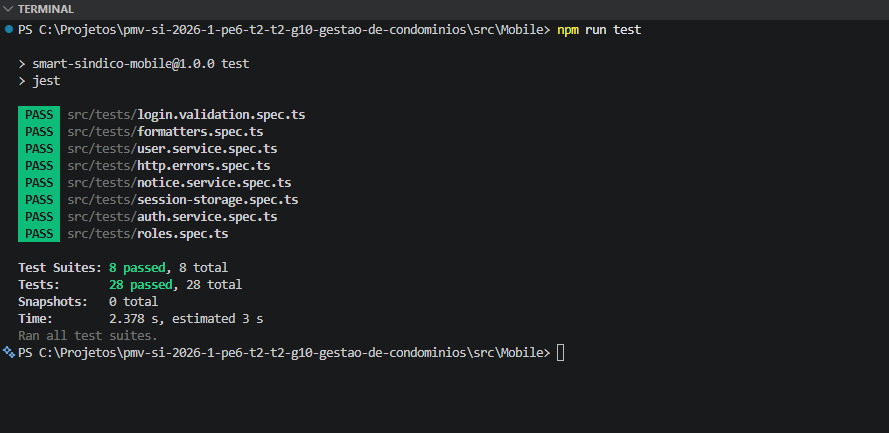

# Referências

- Expo Documentation. Disponível em: <https://docs.expo.dev/>
- React Native Documentation. Disponível em: <https://reactnative.dev/>
- React Navigation Documentation. Disponível em: <https://reactnavigation.org/>
- Axios Documentation. Disponível em: <https://axios-http.com/>
- Jest Documentation. Disponível em: <https://jestjs.io/>
- React Native Testing Library. Disponível em: <https://callstack.github.io/react-native-testing-library/>
