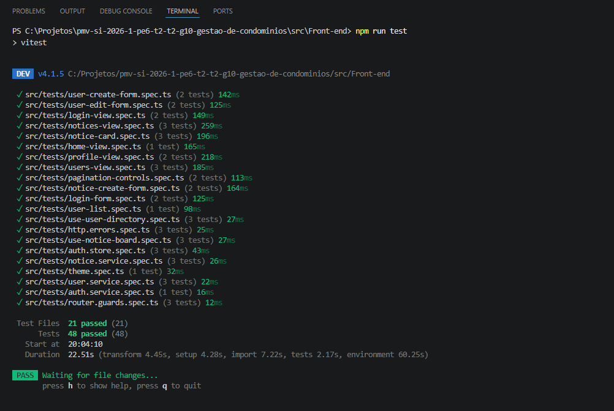

# Front-end Web

## Projeto da Interface Web

O front-end Web do SmartSíndico foi desenvolvido em Vue 3 com TypeScript, Pinia para controle de estado, Vue Router para navegação e Vite como ferramenta de build. A interface é responsável por disponibilizar aos usuários autenticados os fluxos de login, tela inicial, perfil, usuários e mural de avisos, consumindo os dados fornecidos pela API REST do backend.

O foco da interface Web é permitir que síndicos, funcionários e moradores acessem funcionalidades conforme seus perfis de autorização. As telas foram organizadas com navegação protegida por autenticação e regras de permissão, de forma que cada usuário visualize apenas os recursos compatíveis com seu papel no sistema.

### Funcionalidades cobertas

- Login e restauração de sessão;
- Tela inicial com comunicados em destaque;
- Perfil do usuário autenticado;
- Listagem, filtro, paginação, criação e edição de usuários;
- Mural de avisos com listagem, filtro por status, destaque, desativação e reativação.

## Fluxo de Dados

O fluxo de dados da interface segue o padrão cliente-servidor:

1. O usuário interage com uma tela Vue.
2. A tela aciona uma store, composable ou service.
3. O service envia uma requisição HTTP para a API.
4. A API retorna os dados em JSON.
5. O estado reativo da tela é atualizado.
6. A interface renderiza o resultado para o usuário.

Nos testes automatizados, as chamadas HTTP são simuladas por mocks. Isso permite validar o comportamento do front-end sem depender do backend em execução.

## Tecnologias Utilizadas

- `Vue 3`: construção da interface;
- `TypeScript`: tipagem estática;
- `Vite`: ambiente de desenvolvimento e build;
- `Pinia`: estado global de autenticação;
- `Vue Router`: controle de rotas;
- `Axios`: comunicação HTTP com a API;
- `Vitest`: execução dos testes automatizados;
- `@vue/test-utils`: montagem e interação com componentes Vue em testes;
- `jsdom`: simulação de DOM para testes unitários e de componentes.

## Considerações de Segurança

A aplicação Web utiliza autenticação baseada em token JWT. O token retornado pelo backend é persistido localmente e enviado nas próximas requisições por meio do interceptor HTTP configurado no cliente Axios.

As rotas protegidas consultam a sessão autenticada e as permissões do perfil do usuário. O front-end aplica regras de visibilidade para botões, formulários e telas, mas a decisão final de autorização permanece no backend.

## Implantação

O front-end Web do SmartSíndico pode ser implantado como uma aplicação estática, pois o build final gera arquivos HTML, CSS e JavaScript prontos para serem servidos por um servidor Web ou por uma plataforma de hospedagem de aplicações estáticas.

Antes da implantação, é necessário instalar as dependências do projeto no diretório `src/Front-end`:

```bash
npm install
```

Em seguida, a versão de produção deve ser gerada com o comando:

```bash
npm run build
```

O resultado do build é gerado na pasta `dist`. Essa pasta contém os arquivos que devem ser publicados no ambiente escolhido. Entre as opções possíveis estão servidores Web como Nginx ou Apache, serviços de hospedagem estática, plataformas em nuvem ou ambientes acadêmicos disponibilizados para entrega do projeto.

### Configuração da API

A comunicação com o backend é feita por meio de requisições HTTP. Em ambiente de desenvolvimento, o Vite pode utilizar proxy para encaminhar chamadas iniciadas em `/api`. Em produção, recomenda-se configurar explicitamente a URL da API por variável de ambiente:

```bash
VITE_API_BASE_URL=https://endereco-da-api
```

Essa configuração evita que o front-end dependa do endereço local usado durante o desenvolvimento. Também facilita a publicação em ambientes diferentes, como homologação e produção.

### Requisitos do ambiente

O ambiente de implantação deve atender aos seguintes pontos:

- Disponibilizar os arquivos da pasta `dist` por HTTP ou HTTPS;
- Permitir acesso do navegador ao domínio da API;
- Garantir que o backend esteja configurado com CORS para aceitar a origem do front-end;
- Utilizar HTTPS em ambientes públicos, principalmente por causa do envio do token JWT nas requisições autenticadas;
- Configurar fallback para `index.html`, pois a aplicação usa Vue Router e rotas do lado do cliente.

### Validação pós-deploy

Após a publicação, devem ser verificados os principais fluxos da aplicação:

1. Acessar a tela de login.
2. Realizar login com usuário válido.
3. Confirmar o redirecionamento para a tela inicial.
4. Validar o carregamento dos comunicados em destaque.
5. Acessar o perfil e confirmar a exibição dos dados do usuário.
6. Acessar a tela de usuários e testar filtros, paginação, criação e edição.
7. Acessar o mural de avisos e testar filtros, desativação e reativação.

Além da validação manual, recomenda-se executar os testes automatizados antes da publicação:

```bash
npm run test:run
```

Também deve ser executado o build de produção para garantir que não há erros de TypeScript ou empacotamento:

```bash
npm run build
```

Com esses passos, a implantação do front-end garante que a interface publicada esteja alinhada com a API configurada, com as rotas funcionando corretamente e com os principais fluxos validados antes da entrega.

## Testes

Os testes automatizados do front-end Web foram criados para validar apenas as funcionalidades sob responsabilidade direta desta implementação: login, perfil, usuários, home page e mural de avisos. As demais áreas do sistema não foram incluídas na cobertura para evitar assumir manutenção de módulos implementados por outros integrantes.

A suíte utiliza `Vitest`, `@vue/test-utils` e `jsdom`. Foram priorizados testes unitários, testes de services, testes de composables e testes de componentes/telas. As chamadas HTTP são simuladas por mocks, permitindo validar o contrato do front-end com a API sem depender do backend ou do banco de dados.

### Escopo testado

- Autenticação e sessão;
- Login e mensagens de erro;
- Perfil do usuário;
- Usuários, incluindo listagem, filtro, paginação, criação e edição;
- Home page com comunicados ativos em destaque;
- Mural de avisos, incluindo filtro por status, paginação, desativação, reativação e destaque.

### Casos de teste do front-end

| ID | Arquivo de teste | Tela, rota ou service | Payload, entrada ou mock | Resultado esperado |
| --- | --- | --- | --- | --- |
| CT-FE-001 | `auth.service.spec.ts` | `POST /api/autenticacao/entrar` | `{ "email": "sindico@teste.com", "senha": "123456" }` | Envia as credenciais para `/autenticacao/entrar` e retorna os dados da sessão. |
| CT-FE-002 | `auth.store.spec.ts` | Store de autenticação | Sessão válida em `localStorage` | Restaura a sessão e marca o usuário como autenticado. |
| CT-FE-003 | `auth.store.spec.ts` | Store de autenticação | Sessão expirada em `localStorage` | Remove a sessão expirada e mantém o usuário não autenticado. |
| CT-FE-004 | `login-view.spec.ts` | `/login` | Erro `401 Unauthorized` no login | Exibe mensagem de e-mail ou senha inválidos e não redireciona. |
| CT-FE-005 | `login-view.spec.ts` | `/login` | Erro de rede no login | Exibe mensagem de indisponibilidade do sistema. |
| CT-FE-006 | `profile-view.spec.ts` | `/perfil` | Resposta de `GET /api/usuarios/{id}` com dados do usuário | Exibe o perfil e mostra apenas o último login na área de informações da conta. |
| CT-FE-007 | `profile-view.spec.ts` | `/perfil` | Payload de atualização do formulário de perfil | Chama `PATCH /api/usuarios/{id}` e sincroniza o perfil no store de autenticação. |
| CT-FE-008 | `user.service.spec.ts` | `GET /api/usuarios` | Query `{ "page": 2, "pageSize": 10, "search": "ana", "ativo": false }` | Envia paginação, busca e filtro de status para a API. |
| CT-FE-009 | `user.service.spec.ts` | `GET /api/usuarios/{id}` | ID `7` | Consulta `/usuarios/7`. |
| CT-FE-010 | `user.service.spec.ts` | `POST /api/usuarios` | Cadastro com nome, e-mail, senha, CPF, perfil e apartamento | Envia o payload para `/usuarios`. |
| CT-FE-011 | `user.service.spec.ts` | `PATCH /api/usuarios/{id}` | Edição com nome, e-mail, perfil, apartamento e status | Envia o payload para `/usuarios/{id}`. |
| CT-FE-012 | `use-user-directory.spec.ts` | Composable de usuários | `{ "page": 2, "search": " Ana ", "ativo": false }` | Normaliza a busca e atualiza usuários, página, totais e filtro atual. |
| CT-FE-013 | `use-user-directory.spec.ts` | Composable de usuários | Lista de apartamentos ativos e inativos | Disponibiliza apenas apartamentos ativos para seleção. |
| CT-FE-014 | `users-view.spec.ts` | `/usuarios` | Usuário com perfil `Sindico` | Carrega a primeira página da listagem de usuários. |
| CT-FE-015 | `users-view.spec.ts` | `/usuarios` | Clique no filtro `Inativos` | Solicita usuários com `ativo: false`. |
| CT-FE-016 | `users-view.spec.ts` | `/usuarios` | Clique em usuário da tabela | Navega para `/usuarios/{id}/editar`. |
| CT-FE-017 | `user-list.spec.ts` | Lista de usuários | Clique na linha de um usuário | Emite evento de edição com o usuário selecionado. |
| CT-FE-018 | `home-view.spec.ts` | `/` | Comunicados ativos, inativos, com e sem destaque | Busca `ativo: true` e renderiza apenas comunicados ativos em destaque. |
| CT-FE-019 | `notice.service.spec.ts` | `GET /api/comunicados` | Query `{ "page": 1, "pageSize": 4, "ativo": true }` | Envia paginação e filtro de status para a API. |
| CT-FE-020 | `notice.service.spec.ts` | `GET /api/comunicados/{id}` | ID `4` | Consulta `/comunicados/4`. |
| CT-FE-021 | `notice.service.spec.ts` | `POST /api/comunicados` | `{ "titulo": "Aviso", "conteudo": "Conteudo", "destaque": true }` | Envia o comunicado para `/comunicados`. |
| CT-FE-022 | `notice.service.spec.ts` | `PATCH /api/comunicados/{id}/ativo` | `{ "ativo": false }` | Envia alteração de status do comunicado. |
| CT-FE-023 | `notice.service.spec.ts` | `PATCH /api/comunicados/{id}/destaque` | `{ "destaque": false }` | Envia alteração de destaque do comunicado. |
| CT-FE-024 | `use-notice-board.spec.ts` | Composable do mural | `{ "page": 1, "ativo": true }` | Carrega comunicados paginados e preserva o filtro atual. |
| CT-FE-025 | `use-notice-board.spec.ts` | Composable do mural | Desativação e reativação do comunicado `1` | Atualiza o estado local após arquivar e reativar. |
| CT-FE-026 | `notice-card.spec.ts` | Card de comunicado | Comunicado ativo e usuário com permissão de gestão | Exibe ações de definir destaque e desativar. |
| CT-FE-027 | `notice-card.spec.ts` | Card de comunicado | Comunicado inativo e usuário com permissão de gestão | Exibe status inativo e ação de reativar. |
| CT-FE-028 | `notices-view.spec.ts` | `/avisos` | Carregamento inicial do mural | Carrega comunicados sem filtro de status. |
| CT-FE-029 | `notices-view.spec.ts` | `/avisos` | Clique nos filtros `Ativos` e `Inativos` | Solicita comunicados com `ativo: true` e `ativo: false`. |
| CT-FE-030 | `notices-view.spec.ts` | `/avisos` | Clique em `Desativar` | Chama a desativação e recarrega a página atual. |
| CT-FE-031 | `pagination-controls.spec.ts` | Componente de paginação | `page: 2`, `pageSize: 10`, `totalItems: 35`, `totalPages: 4` | Exibe `Mostrando 11 a 20 de 35 registros` e emite a página `3`. |
| CT-FE-032 | `pagination-controls.spec.ts` | Componente de paginação | `loading: true` | Bloqueia a troca de página enquanto carrega. |

### Execução dos testes

Os testes são executados no diretório `src/Front-end` com o comando:

```bash
npm run test:run
```

Na execução registrada, a suíte automatizada do front-end apresentou o seguinte resultado:




# Referências

- Vue.js Documentation. Disponível em: <https://vuejs.org/>
- Vitest Documentation. Disponível em: <https://vitest.dev/>
- Vue Test Utils Documentation. Disponível em: <https://test-utils.vuejs.org/>
