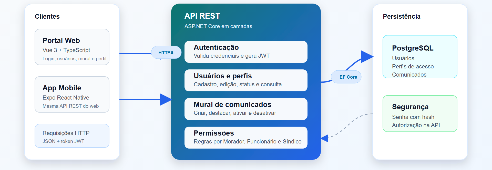
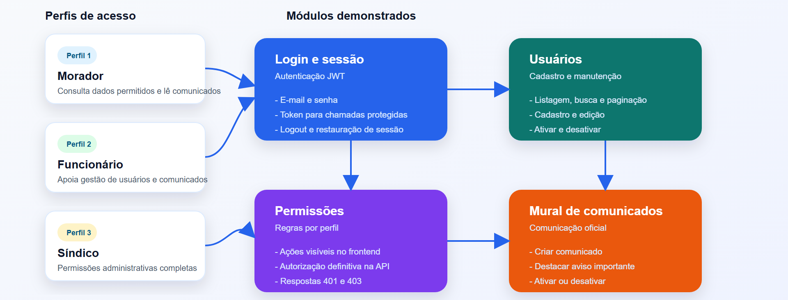

# Apresentação da Solução

## SmartSíndico

O SmartSíndico é uma solução distribuída para gestão de condomínios, desenvolvida para apoiar processos administrativos, melhorar a comunicação entre síndico, funcionários e moradores, e reduzir a dependência de controles manuais como planilhas, livros físicos e grupos informais de mensagens.

A proposta do projeto surgiu a partir da identificação de problemas comuns na rotina condominial: comunicação descentralizada, dificuldade no controle de usuários e moradores, ausência de um canal oficial para avisos, falta de rastreabilidade nas ações administrativas e necessidade de acesso seguro por perfil de usuário. Para esta entrega, a apresentação concentra-se no recorte funcional desenvolvido e validado: login, mural de comunicados, cadastro e manutenção de usuários, e controle de permissões.

## Resumo do Processo de Desenvolvimento

O desenvolvimento do SmartSíndico foi organizado em etapas, seguindo a metodologia proposta pela disciplina de Projeto - Arquitetura de Sistemas Distribuídos.

Na primeira etapa, foi realizada a documentação de contexto, com levantamento do problema, justificativa, público-alvo, requisitos funcionais e não funcionais, catálogo de serviços e definição inicial da arquitetura da solução. Nessa fase, o grupo definiu que o sistema deveria atender moradores, funcionários e síndico ou administração, cada um com permissões diferentes.

Na segunda etapa, foi planejada e implementada a API REST do sistema. O backend foi desenvolvido em ASP.NET Core, com organização em camadas de API, aplicação, domínio e infraestrutura. A persistência foi definida com PostgreSQL e Entity Framework Core, enquanto a autenticação foi implementada com JWT. Nesta entrega, o backend demonstrado concentra os fluxos de autenticação, usuários, comunicados e permissões por perfil.

Na terceira etapa, foi desenvolvida a aplicação web em Vue 3 com TypeScript. O portal web consome os dados da API, aplica navegação protegida por autenticação e disponibiliza telas para login, início, perfil, gerenciamento de usuários e mural de avisos. A interface foi pensada para evidenciar a separação entre usuários comuns e usuários com permissão administrativa.

Na quarta etapa, foi desenvolvido o aplicativo mobile em Expo React Native com TypeScript. O aplicativo manteve a proposta de arquitetura cliente-servidor, consumindo a mesma API REST utilizada pelo frontend web. Na apresentação, o foco será nos mesmos fluxos principais do recorte implementado: login, sessão autenticada, usuários, permissões e mural de avisos.

Na etapa final, o grupo consolidou a entrega da solução, documentando o percurso de desenvolvimento e preparando uma demonstração em vídeo com o funcionamento da aplicação.

## Arquitetura da Solução

A arquitetura do SmartSíndico segue o modelo cliente-servidor, com separação entre backend, frontend web, aplicativo mobile e banco de dados.

Os principais componentes são:

- API REST em ASP.NET Core, responsável por regras de negócio, autenticação, autorização e acesso aos dados;
- Banco de dados PostgreSQL, responsável por armazenar os dados utilizados pelos fluxos demonstrados, como usuários, perfis de acesso e comunicados;
- Frontend web em Vue 3, voltado para uso administrativo e acesso via navegador;
- Aplicativo mobile em Expo React Native, voltado para acesso em dispositivos móveis;
- Comunicação entre clientes e backend por HTTP, com dados em JSON e autenticação por token JWT.

Essa organização evidencia os princípios de sistemas distribuídos trabalhados na disciplina, pois os clientes web e mobile executam separadamente da API e dependem da comunicação em rede para consultar, criar e atualizar informações.

### Diagramas de apoio para a apresentação

Os diagramas abaixo foram preparados para apoiar a explicação da arquitetura e do recorte funcional durante o vídeo.





## Funcionalidades Entregues

A solução demonstrada contempla os seguintes fluxos principais:

- Login com e-mail e senha;
- Geração e uso de token JWT para sessão autenticada;
- Controle de acesso por perfil de usuário: Morador, Funcionário e Síndico;
- Tela inicial autenticada com informações resumidas;
- Consulta e edição de perfil do usuário autenticado;
- Listagem, busca, paginação, cadastro e edição de usuários;
- Ativação e desativação de usuários conforme permissões;
- Mural digital de comunicados;
- Criação, consulta, destaque, ativação e desativação de comunicados;
- Interface web responsiva para uso administrativo;
- Aplicativo mobile com telas adaptadas para celular nos fluxos de login, usuários e mural.

Outros módulos inicialmente previstos no projeto, como portaria, visitantes, apartamentos, reservas e ocorrências, não serão o foco desta apresentação por estarem fora do recorte funcional principal demonstrado nesta entrega.

## Segurança

A segurança da aplicação foi tratada principalmente no backend, por meio de autenticação JWT, validação de dados de entrada, hash de senhas, controle de autorização por perfil e respostas padronizadas para erros de validação, autenticação e permissão.

No frontend web e no aplicativo mobile, as interfaces aplicam regras de visibilidade conforme o perfil do usuário, evitando que ações não permitidas apareçam para usuários sem permissão. Ainda assim, a decisão final de autorização permanece na API, garantindo maior consistência e segurança.

## Testes e Validação

Foram realizados testes automatizados e validações manuais nas principais partes do sistema.

No backend, a suíte de testes cobre autenticação, autorização, gerenciamento de usuários e comunicados, combinando testes unitários e testes de integração. A documentação da etapa de APIs registra 44 cenários automatizados relacionados principalmente a esse recorte.

No frontend web, os testes foram desenvolvidos com Vitest, Vue Test Utils e jsdom, validando services, stores, composables, componentes e telas relacionadas a login, perfil, usuários, home e mural de avisos. A documentação da etapa web registra 48 cenários automatizados.

No aplicativo mobile, os testes foram desenvolvidos com Jest e React Native Testing Library, cobrindo services, armazenamento de sessão, validações de login, regras de perfil, tratamento de erros e formatação de dados. Também foram registradas validações manuais dos fluxos principais no dispositivo.

## Instruções para Execução da Aplicação

Para executar a API localmente:

```powershell
cd src\Back-end
dotnet run --project src\Api\Api.csproj --launch-profile http
```

A API fica disponível em:

```text
http://localhost:5053
```

Para executar o frontend web:

```powershell
cd src\Front-end
npm install
npm run dev
```

Para executar o aplicativo mobile:

```powershell
cd src\Mobile
npm install
npm start
```

O aplicativo mobile utiliza a variável `EXPO_PUBLIC_API_BASE_URL` para definir o endereço da API. Em testes com celular físico, o computador e o celular devem estar na mesma rede Wi-Fi, e a API deve estar acessível pelo IP da máquina.

Usuários de teste documentados para a aplicação:

| Perfil | E-mail | Senha |
| --- | --- | --- |
| Morador | `morador@smartsindico.local` | `123456` |
| Síndico | `sindico@smartsindico.local` | `123456` |

## Demonstração em Vídeo

O vídeo de apresentação deve demonstrar o funcionamento do recorte desenvolvido e relacionar a aplicação final com o problema identificado no início do projeto, sem aprofundar módulos que não fazem parte da entrega demonstrada.

Link do vídeo:

[Vídeo de apresentação da Etapa 5](https://drive.google.com/file/d/1GRZaH1CPehZ_2lLRQbcUT3kpqmHTvB7Q/view?usp=sharing)

## Considerações Finais

O SmartSíndico atingiu o objetivo de construir uma base funcional para uma aplicação distribuída de gestão condominial. O recorte entregue integra backend, frontend web e aplicativo mobile em torno de uma API REST protegida por autenticação e autorização por perfil.

Mesmo com possibilidade de evolução para módulos mais completos de reservas, visitantes, portaria e ocorrências, a entrega atual já demonstra os fundamentos essenciais do projeto: comunicação entre camadas, segurança, organização de dados, interfaces em múltiplas plataformas e testes para validação dos fluxos de login, usuários, permissões e mural.
